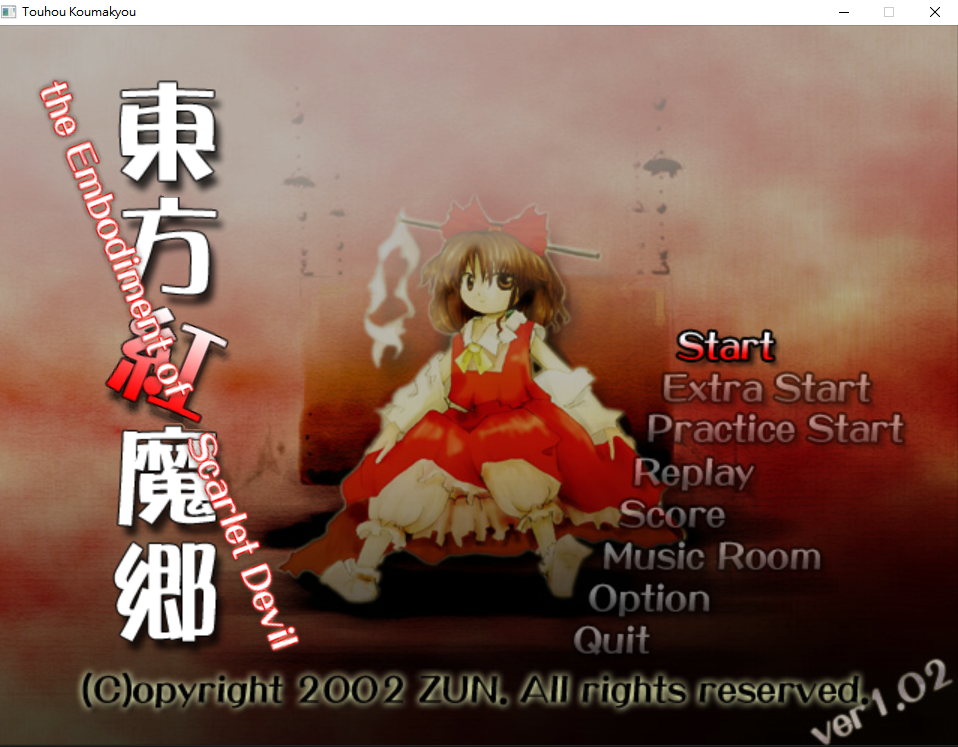
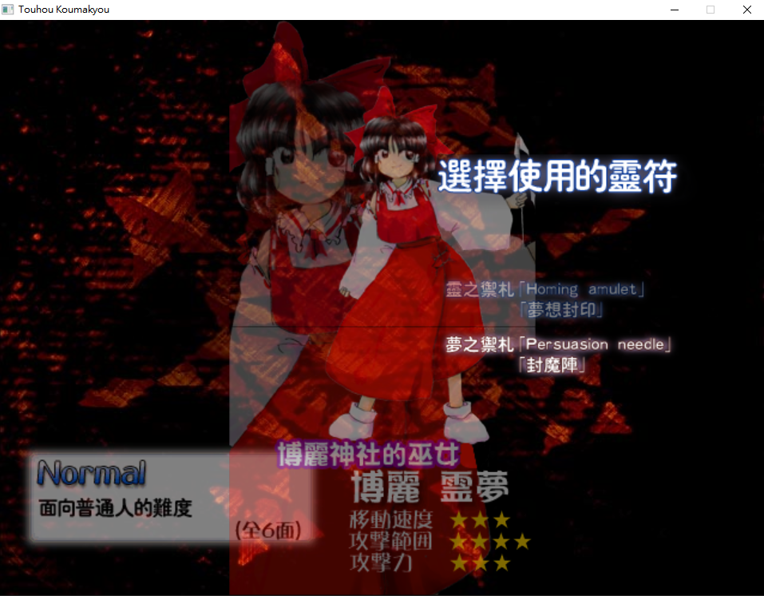
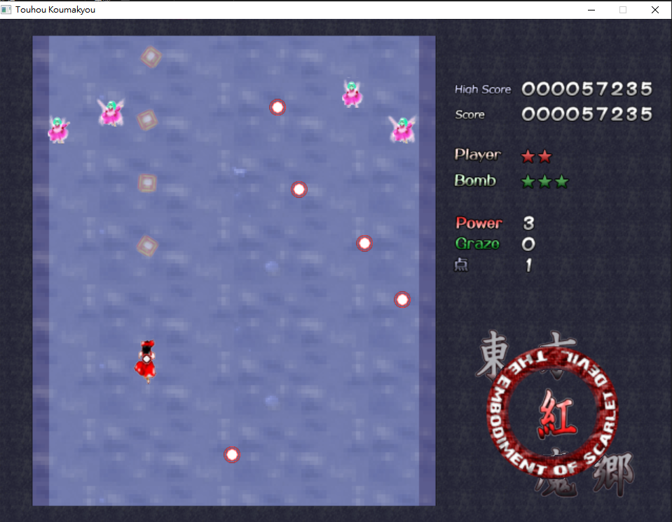
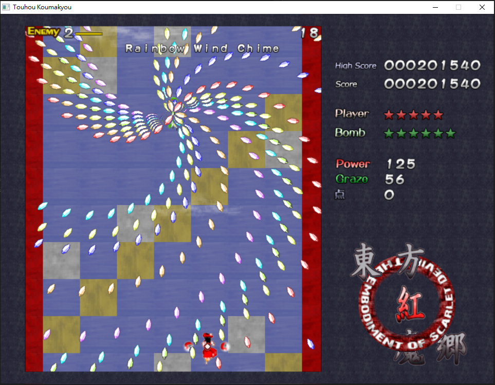
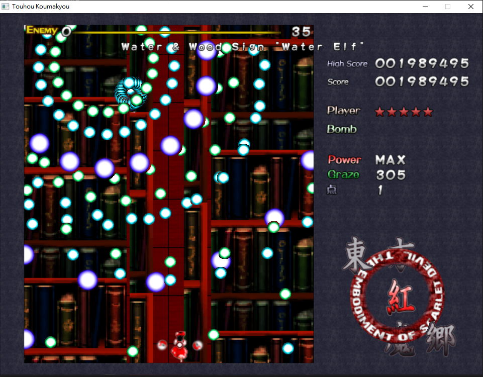

# 2026 OOPL Final Report

## 組別資訊

組別：T04

組員：彭佑仁

復刻遊戲：東方紅魔鄉

## 專案簡介

### 遊戲簡介

《東方紅魔鄉》是一款 2D 彈幕射擊遊戲。玩家操作自機在畫面中移動、射擊，並在密集的敵彈與雷射中閃避攻擊。

### 組別分工

| 組員 | 負責內容 |
|------|----------|
| 彭佑仁 | 負責遊戲主要系統與關卡內容實作，包含場景流程、玩家、敵人、彈幕、道具、HUD，以及期末報告。 |

## 遊戲介紹

### 遊戲規則

玩家操作自機閃避敵人發射的子彈與雷射，同時攻擊敵人。一般移動速度較快，按住低速鍵時移動速度會下降，方便在密集彈幕中精準閃避。

遊戲主要規則如下：

- `Z` 鍵用於開火與選單確認，`X` 鍵用於施放炸彈與選單取消。
- 方向鍵上下左右用於控制角色移動。
- 按住 `Shift` 鍵時會進入低速移動，方便玩家精準閃避密集彈幕。
- 玩家被敵彈、雷射命中時會死亡並消耗生命，若復活時炸彈（Bomb）數量不滿三顆就補滿三顆。
- 玩家死亡後會重生，並獲得短暫無敵時間。
- 玩家可以使用炸彈（Bomb）。釋放炸彈後會消除畫面中的子彈並提升自機攻擊力，持續一小段時間。
- 收集 power 道具可以提升火力；power 達到最大值後，再次獲得 power 會轉換為分數。
- 收集 point item 可以獲得分數，分數達到指定門檻時會獲得額外生命。
- 靠近敵彈但沒有被打中時（擦彈）會增加分數作為擦彈獎勵（graze）。

### 遊戲畫面











## 程式設計

### 程式架構

本專案採用 scene-based 架構。`App` 持有目前執行中的 `Scene`，每個 scene 負責自己的更新、繪製與下一個 scene 的建立。當目前 scene 結束後，`App` 會呼叫 `NextScene()` 取得下一個 scene，並透過 `std::move` 轉移 `std::unique_ptr` 的所有權。

主要 scene 包含：

- `Loading`：啟動時驗證設定檔、初始化音效系統，並建立 Title。
- `Title`：標題畫面與主選單。
- `Select`：難度、角色與射擊類型（shot type）選擇。
- `PlayableStage`：可遊玩關卡的共同基底，整合玩家、敵人、道具、GUI、背景、暫停選單與 cheat menu。
- `Stage1` 到 `Stage6`：各關卡自己的設定、背景、stage script 與下一關轉場。

主要系統類別包含：

- `Player`：玩家狀態、移動、射擊、死亡、重生與 bomb。
- `EnemyManager`：敵人生成、Boss 狀態、Boss phase、敵人死亡、玩家子彈傷害與碰撞。
- `EnemyBulletManager`：敵彈物件池、彈幕生成、移動、擦彈與命中判定。
- `EnemyLaserManager`：雷射生成、更新、旋轉、碰撞與轉換道具。
- `ItemManager`：道具生成、掉落、吸收與分數處理。
- `Gui`：HUD 顯示，例如 score、power、graze、life、bomb 與 Boss HP。
- `AudioManager`：音效與 BGM 播放。
- `IStageScript` 與各 Stage script：定義關卡敵人行為、Boss pattern 與階段切換。

### 程式技術

使用物件導向方式拆分責任。玩家不直接管理敵人彈幕，敵人也不直接修改 GUI，而是透過 manager 與 `GameManager` 傳遞遊戲狀態。這樣可以降低系統之間的耦合，也讓不同功能更容易維護。

關卡內容採用資料與程式混合的方式管理。Stage timeline、Boss phase、敵人初始化資料、reward 與 movement profile 放在 JSON 設定檔中，程式端再由 loader 讀取並套用。這讓關卡數值與流程調整不需要每次都直接修改 C++ 邏輯。

敵彈、雷射、道具與特效等大量生成的物件使用 object pool 管理，避免遊戲過程中頻繁 new/delete，降低即時遊戲中的效能波動與 memory leak 風險。Scene 使用 `std::unique_ptr` 管理生命週期，切換場景時舊 scene 會自動釋放。音效系統 `AudioManager` 使用 singleton，確保全域只存在一個音效管理器。

Debug mode 集中在 cheat menu。玩家在關卡中輸入上上下下左右左右 BA 後會開啟 cheat menu。選單提供滿 power、加生命、加 bomb、跳到 midboss、跳到 final boss、跳到 Stage1 到 Stage6、切換無敵等功能。

### 使用到 AI/AI Agent 的部分 (沒有用到者，不需要寫這篇)

本專題有使用 AI Agent 協助開發，主要負責關卡腳本與彈幕 pattern 中較大量、重複性高的程式實作。彈幕遊戲的關卡內容需要撰寫許多敵人行為、midboss、final boss、Boss phase、發彈 pattern、timeline 與轉場邏輯。這些程式細節不同，但整體結構相似，因此適合讓 AI Agent 依照既有架構協助產生初稿，再由開發者測試與調整。

AI Agent 主要協助的部分如下：

- 協助撰寫多個 Stage 的 script 架構，例如 `Stage1Script` 到 `Stage6Script` 中敵人生成、Boss phase 註冊、timer callback、death callback 與關卡轉場等邏輯。
- 協助撰寫關卡中的一般敵人 pattern 的移動、發彈、消失與道具掉落行為。
- 協助撰寫 midboss 與 final boss 的 pattern 檔案，例如 `Stage*MidbossPatterns.cpp`、`Stage*FinalBossPatterns.cpp` 中的 Boss 進場、非符、符卡、階段切換與死亡流程。
- 協助整理重複的 pattern helper 與共用邏輯，例如 Boss pose 設定、座標轉換、Boss phase start、reward、timeline validation 與 config loading。
- 協助將部分關卡資料改成 data-driven 的形式，例如 stage config、boss phase config、enemy init config、movement profile 與 timeline JSON，減少硬編碼。
- 協助在完成 pattern 後進行調整與修正，例如 Boss 符卡的細節修正

AI Agent 的角色主要是先打一份草稿，協助我完成大量關卡程式與重複樣板，讓我可以把更多時間放在遊戲內容規劃、實際遊玩測試與細節調整上。AI 產生的程式並不能無條件採用，仍需要由開發者自行測試，並依照測試結果修改數值或邏輯。

## 結語

### 問題與解決方法

開發過程中遇到的主要問題如下：

| 問題 | 解決方法 |
|------|----------|
| 彈幕物件數量多，頻繁配置記憶體可能造成效能問題 | 使用物件池（object pool）管理敵彈、雷射、道具、特效與敵人生成 |
| 關卡與 Boss 行為容易分散且難維護 | 將共同流程放在 `PlayableStage`、`EnemyManager` 與 `PatternStageScript`，各關只實作自己的 pattern |
| 關卡數值與流程硬編碼會讓調整困難 | 將 stage 設定檔、timeline、boss 數值、敵人數值與敵人行為放入 JSON |
| 測試後面關卡與 Boss 很花時間 | 加入 debug 功能，集中提供跳關、跳 Boss、無敵與補資源功能 |
| memory leak 風險不容易確認 | 使用 `unique_ptr`、`shared_ptr`、object pool 與 singleton 管理生命週期 |

### 自評

| 項次 | 項目                   | 完成 |
|------|------------------------|-------|
| 1    | 這是範例 |  V  |
| 2    | 完成專案權限改為 public |  V  |
| 3    | 具有 debug mode 的功能  |  V  |
| 4    | 解決專案上所有 Memory Leak 的問題  |  V  |
| 5    | 報告中沒有任何錯字，以及沒有任何一項遺漏  |  V  |
| 6    | 報告具備基本美感與可讀性  |  V  |

### 心得

這次專題讓我更了解遊戲程式中不同系統之間的整合方式。彈幕遊戲看起來只是角色移動和躲子彈，但實際上需要同時處理玩家、敵人、敵彈、雷射、道具、GUI、音效、關卡。

在開發過程中，我學到如何使用物件導向方式拆分責任，避免所有邏輯都集中在單一檔案中。我也更理解物件池對遊戲效能的重要性，因為彈幕遊戲會在短時間內生成大量物件，如果每次都動態配置與釋放記憶體，效能與穩定性都可能受到影響。

另外，我認識到 debug 功能對遊戲開發非常重要。如果沒有跳關、加生命、滿 power、跳 Boss 或無敵功能，每次測試後面關卡都會花很多時間。將這些功能集中到 cheat menu 後，測試起來就方便許多。

整體而言，這個專題讓我練習到 C++、物件導向設計、資源管理、遊戲狀態管理、資料驅動設定與大型專案結構整理。雖然仍有角色未實裝、炸彈未實作視覺特效，還有很多地方可以繼續補強，但目前已經是一個能玩的彈幕射擊遊戲了！

### 貢獻比例

| 組員 | 貢獻比例 | 主要貢獻 |
|------|----------|----------|
| 彭佑仁 | 100% | 撰寫程式碼、做期末報告 |

## 注意事項

請使用 MSYS2 UCRT64 環境建置專案。第一次建置前，請先在 **MSYS2 UCRT64** 終端機中安裝以下套件：

- [mingw-w64-ucrt-x86_64-gcc](https://packages.msys2.org/packages/mingw-w64-ucrt-x86_64-gcc)
- [mingw-w64-ucrt-x86_64-cmake](https://packages.msys2.org/packages/mingw-w64-ucrt-x86_64-cmake)
- [mingw-w64-ucrt-x86_64-ninja](https://packages.msys2.org/packages/mingw-w64-ucrt-x86_64-ninja)

可使用以下指令安裝：

```bash
pacman -Syu
pacman -S --needed git mingw-w64-ucrt-x86_64-gcc mingw-w64-ucrt-x86_64-cmake mingw-w64-ucrt-x86_64-ninja
```

然後將 `/ucrt64/bin`加入系統環境變量

# 重要！！！！！！下載遊戲資源

**請先下載 [Resource](https://mega.nz/file/gJ8wVAja#DNPVvdxcQWdsat3_Lbceow-41eM-VAeiT4oiZhvVeGs)，並覆蓋到 `.\touhou-koumakyou-clone\resources`**

若未放置完整資源，遊戲將無法正常遊玩！！！！！
